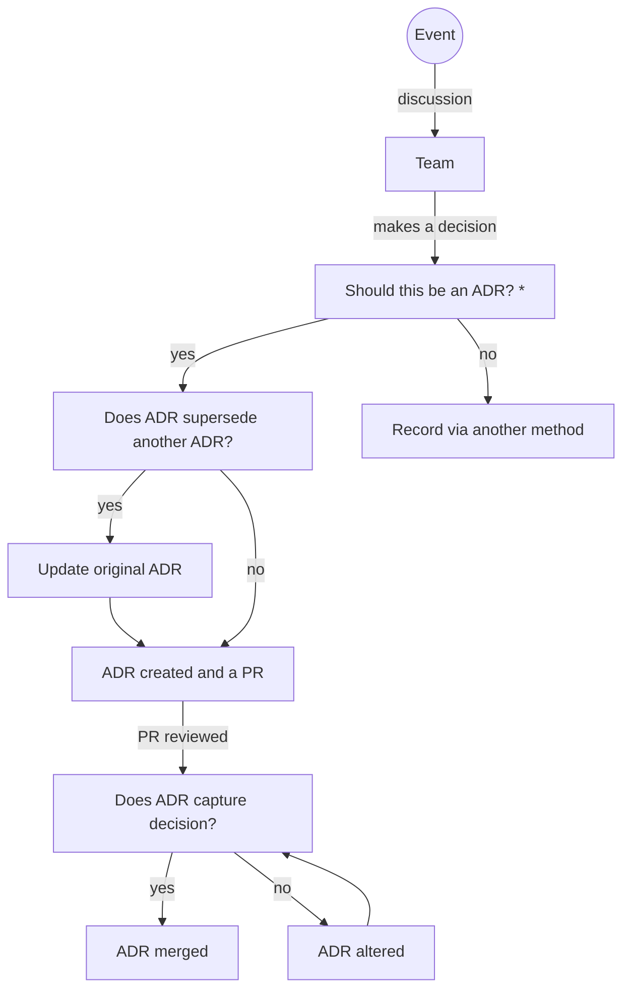

# Decisions
A central place for decisions for the new Ensembl project

- [doc/adr](doc/adr)

# ADR - Architectural Decision Record  

A collection of records for "architecturally significant" decisions: those that affect structure, non-functional characteristics, dependencies, interfaces, or construction techniques. 

ADRs are focused on documenting technical decisions in the implementation of the Ensembl product.

## When should we create an ADR?

## Architecturally significant
What is considered architecturally significant will change over time as both the team and team members perspective change. As of 20/02/2023 we believe architecturally significant to mean the following :- 

- Alters externally visible system properties
- Modifies a public interface 
- Directly influences a high priority quality attribute (attributes of the product that are used to measure success)
- Includes or removes a dependency 
- Direct result of new information about a constraint
- Accepts strategic technical debt 
- Changes the general structures of the system
- Forces developers to change their development approach 

**Decisions do not have to be empirically correct, nor must they stand the test of time**. All decisions are the best we could make given what we knew at the time, our skills & abilities, the resources available, and the situation at hand. We should embrace this in our ADRs instead of trying to prove that technically our decision to use technology A over B is the best when in truth we do not truly know. It is better to say that technology A seemed easier to learn, or was something members of the team are keen to learn.

## Further reading

- Where ADRs got started - https://cognitect.com/blog/2011/11/15/documenting-architecture-decisions.html 
- https://github.com/joelparkerhenderson/architecture-decision-record

# Other decisions

ADRs do not cover all the decisions that are needed to build a product. These other decisions should be captured in this repo but the work to identify both the format and the processes for recording them has not concluded.